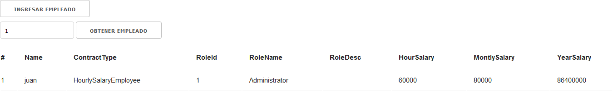

# simple-Node-Mongo-Project

Con este proyecto se quiere demostrar como crear un proyecto en Node.js y a consumiendo una base de datos Mongodb

### DEMO
Al oprimir no ingresar dato en la barra de busqueda, lista los empleados guardados previamente

Cuando se pasa el identificador del empleado como parametro, devuelve la informacion relacionada al empleado 

